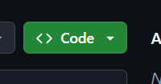
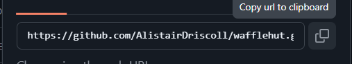
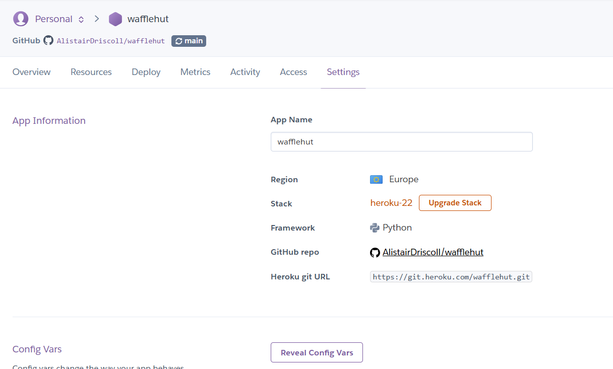
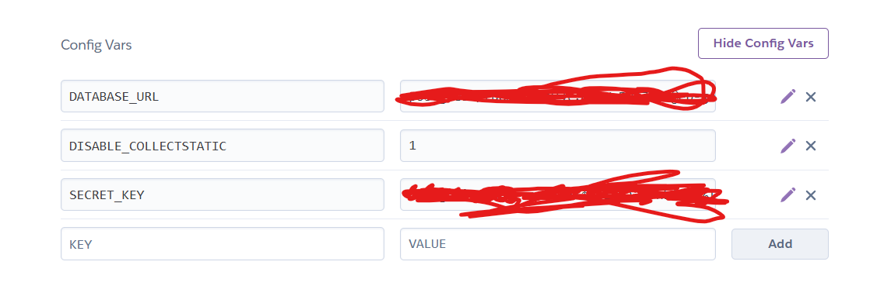
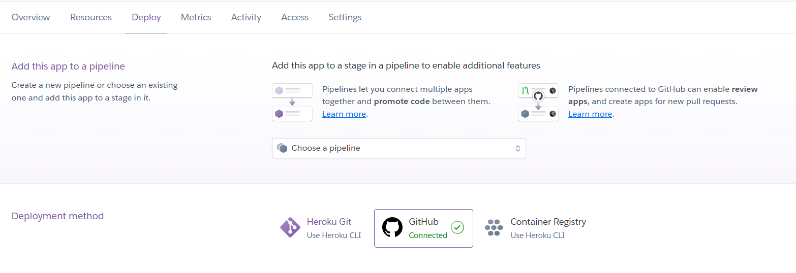
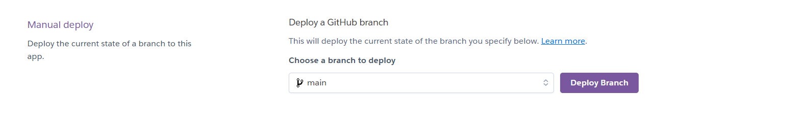
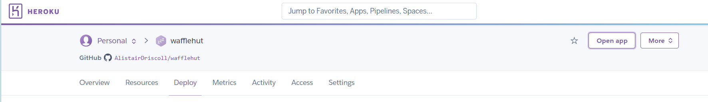

### Deployment

The app was deployed to [Heroku](https://heroku.com)

The database was deployed to Code Institute Postgres Database server, provided to me by The Code Institute who I am studying with currently. This project will be my Project 4 submission in their 'Diploma in Full Stack Development' course. One can look online for other database storage resources if not on this course.

The app can be accessed via this [link](https://wafflehut-b72a2da43389.herokuapp.com/)

## Local deployment

- You can deploy locally by going to the [repository](https://github.com/AlistairDriscoll/wafflehut)

- Then click the code button and copy the HTTPS button and click the 'Copy url to clipboard' button

VS Code is a good example of a code editor in which you could deploy this, if this is what you are using then select 'Clone git repository' From the start section of the welcome page. If the welcome page does not show then open up a new window by pressing the 'file' button and finding the new window option. Once the 'Clone git' button has been pressed then paste the link you copied earlier into the bar that pops up and press enter. Alternatively, you could simply open a terminal if you haven't already and type in the command 'git clone https://github.com/AlistairDriscoll/wafflehut.git'. This same instruction can be followed if you prefer to use gitpod or another editor also.

To deploy locally, you will need to install all the technologies listed on the requirements.txt file, this means you need to open a terminal if you haven't got one open yet and type in the command 'pip3 install -r requirements.txt'

Once the dependencies are installed, you will need to make a file in the main folder (the one that contains the manage.py file) called env.py and add the following:

    
    import os

    os.environ.setdefault(
        "DATABASE_URL", "<your_database_key>" 
    )

    os.environ.setdefault(
        "SECRET_KEY", "<your_secret_key>"
    )

These variables are then put into the operating system, and now the env.py file must be added to the .gitignore file, along with the pycache (by typing '__pycache__/'). All these actions are in place to help protect the user from malicious behaivior. Another thing to note is to keep the debug set to 'False' when the project is not in development, otherwise the user risks sharing private information that could also make them vulnerable to malicious attacks.

Lastly, the database you are using will not have an idea of the models you are using, so you need to make your migrations, then migrate them by typing these commands into the terminal:

    python3 manage.py makemigrations
    python3 manage.py migrate

Then create a superuser for your app

    python3 manage.py createsuperuser

This will ask for a username, email and password, follow the instructions to type them in.

The app is ready to run now! Simply type this command to get it running:

    python3 manage.py runserver

If you ever need to access the superuser section of the app just add '/admin', and log in with your superuser username and password.

## Heroku deployment

In order to deploy to heroku the user will at first need to create/update a requirements file if they haven't already. Type this command into the terminal:

    pip3 freeze > requirements.txt

Then make a file called 'Procfile' in the main folder (again, the same folder that contains the manage.py and requirements.txt files) and put this line of code in it:

    web: gunicorn wafflehut.wsgi

- or if you change the name of the app then change it accordingly:

    web: gunicorn <your_app_name>.wsgi

Then add, commit and push the changes to github. You will need to make a new repository for this.

The next step would be to go to [Heroku](https://heroku.com) and create an account if you don't have one, then press the button to make a new app and go through the instructions.

Now click on the settings tab and click 'Reveal config vars':

Then you need to add three. Firstly type in DISABLE_COLLECTSTATIC on the right column and set the value to 1 on the left. Then put the values of your env.py file in also with 'DATABASE_URL' and 'SECRET_KEY' to the left and their values to the right.

Now click on the deploy tab and press the button to connect with github:

Connect to your github account and find the repository that contains the project, then click connect.

Lastly, scroll to the bottom and select the deploy branch button.

You can now click the 'Open app' button at the top right to go onto your app.

