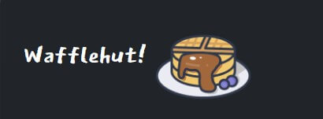
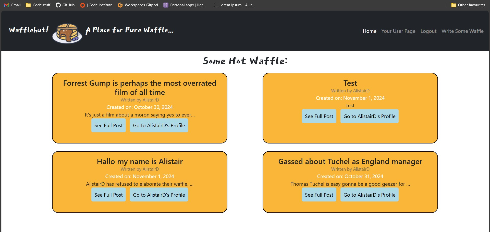
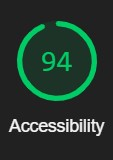
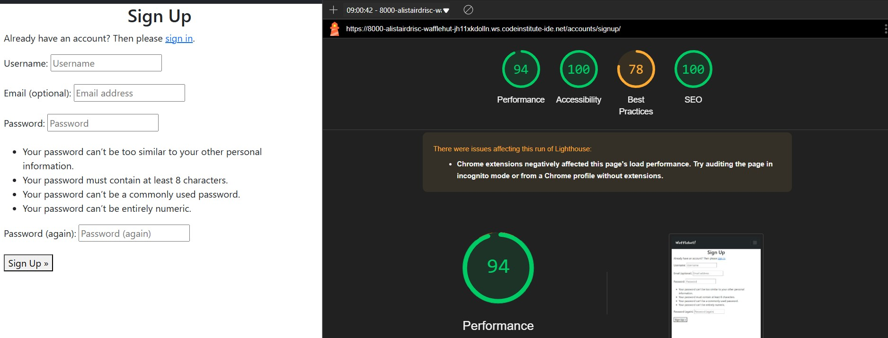

# Wafflehut

This app was developed by [Alistair Driscoll](https://github.com/AlistairDriscoll)

The full repository can be found [here](https://github.com/AlistairDriscoll/wafflehut)

## About

Wafflehut is a Reddit-style website that is all about people sharing their opinions, but with a sort of twist. Wafflehut is designed to be an environment where people can share and talk about their maybe more controversial opinions on things. I chose the name Wafflehut from an English slang word 'waffle'. If someone is talking nonsense then they might be told that they are 'talking absolute waffle' or that they are 'waffling on a bit'. In using this in the name of the website users can hopefully understand that they are in an environment where they can talk about stuff they normally don't talk about, but in a jesty kind of way, hopefully adding a sense of camaraderie and banter to the user experience that one does not normally see on other sites.

## User-Stories

### First-Time/Unregistered Visitor Goals

| Issue ID    | User Story |
|-------------|-------------|
|[#1](https://github.com/AlistairDriscoll/wafflehut/issues/1)| As an unregistered user I can look at some posts done by registered users so that I can see what the website is about|
|[#2](https://github.com/AlistairDriscoll/wafflehut/issues/2)| As a first time user I can navigate through the website easily so that I have a good user experience and find the right content and pages with ease|
|[#3](https://github.com/AlistairDriscoll/wafflehut/issues/3)| As a first time/unregistered user I can sign up to the website easily so that I can comment and react to posts as well as put posts of my own|

### Frequent/Registered Visitor Goals

| Issue ID    | User Story |
|-------------|-------------|
|[#4](https://github.com/AlistairDriscoll/wafflehut/issues/4)| As a regular/registered user I can create, update and delete posts so that I can share my opinions on the website for others to see|
|[#7](https://github.com/AlistairDriscoll/wafflehut/issues/7)| As a regular/registered user I can delete my account so that no one can see my posts, comments or reactions anymore if I want to come off the site|

## The Database

The database is based on the Django provided User model, the UserRank model and the Post model.
The UserRank model is created via the signals.py code whenever a user is made, originally designed to just be a score tally I thought to also add functionality for the user to be able to say more about themself. The Post model has a many to one relationship with the User as the user will be able to post many different posts but each of them only addigned to the one user.

## Features

For an in-depth look into the wireframes and features, please refer to the [FEATURES.md](FEATURES.md) file.

## Deployment

To find out about deployment, refer to the [DEPLOYMENT.md](DEPLOYMENT.md) file.

## Future Improvements

Too see any future improvements, click [here.](FutureImprovements.md)

## Mistakes

In terms of mistakes, I kept on accidentally keeping the debug set to true when I committed the code to github. Another would be the fact that I wrote some of the IDs of elements in camel case instead of kebab case as is standard convention. I did this as I got used to seeing bootstrap name their IDs with camel case so presumed to do the same.

## Technologies Used

- Django: Version 4.2.5
- Django Crispy Forms
- Django Allauth
- Django Summernote
- Bootstrap
- Whitenoise
- CSS
- Javascript
- HTML
- Python: Version 3.2
- Heroku
- GitHub
- FontAwesome: special appreciation for the website that provided over 6000 different waffle icons to choose from!
- Jquery in order to work javascript

## Compatibility

Here is the website displaying in Edge, Chrome and firefox.

## Lighthouse

For the home page:

For the userpage:

For a view_full_post page:

Sign in page:

Sign out page:

Sign-up page

