# Testing

## Manual Testing

| Page    | User Actions           | Expected Results | Y/N | Comments    |
|-------------|------------------------|------------------|------|-------------|
| Sign Up     |                        |                  |      |             |
| 1           | Click on Sign Up button | Redirection to Sign Up page | Y |          |
| 2           | Enter a username, input an invalid password twice and press sign-up button | Declines sign-up with a message saying why | Y |          |
| 3           | Enter a username, input two different passwords and press sign-up button | Declines sign-up | Y |          |
| 4           | Enter a username, input a valid password twice and press sign-up button | Takes user to their new userpage | Y |          |
| 5           | Enter valid email | Field will only accept email address format, declines when email is already used | Y |          |
| Sign In/Out |                        |                  |      |             |
| 1           | Go to logout | Takes user to a confirm logout page | Y |          |
| 2           | Click logout confirmation button | User logged out, directed to home page | Y |          |
| 3           | Press login button | Redirects user to login page | Y |          |
| 4           | Type in login details | Redirects user to their user page | Y |          |
| 5           | Click Remember Me checkbox | Remembers user | Y |          |
| 6           | Click browser back button | You are still logged out | Y |          |
| 7           | Click on Log In button | Redirection to Log In page prefilled | Y |          |
| Navigation  |                        |                  |      |             |
| 1           | Click on the logo | Redirection to home page | Y |          |
| 2           | Click User Page button | Redirection to user page | Y |          |
| 4           | Click 'View full post' link | Redirection to full post page | Y |          |
| 5           | Click 'Write some waffle' link | Redirection to write post page | Y |          |
| User Page   |                        |                  |      |             |
| 1           | Go onto page | Users UserRank info displayed along with posts | Y |          |
| 2           | Click 'Update information' button | Modal appears with update user form | Y |          |
| 3           | Fill out update user form and send | User Info updates and displays | Y |          |
| 4           | Press delete account button | Confirm delete modal shows | Y |          |
| 5           | Press modal delete account button | Deletes account  | Y |          |
| 6           | Goes on a different users page | Displays the same content except without buttons to create edit or delete  | Y |          |
| Full post page |                        |                  |      |             |
| 1           | Click edit button | Modal with edit post form appears prepopulated with the post content | Y |          |
| 2           | Click delete button | Modal with delete functionality appears | Y |          |
| 3           | Other users apart from the authenticated post author see the page | Full post still shows but without delete or edit buttons | Y |          |
| Wafflescore |                        |                  |      |             |
| 1           | User creates an account | UserRank instance made with wafflescore set to zero | Y |             |
| 2           | User uploads post | Wafflescore goes up a point | Y |             |
| 3           | User deletes post | Wafflescore goes down a point | Y |             |

## Compatibility

Here is the website displaying in Edge, Chrome and firefox.

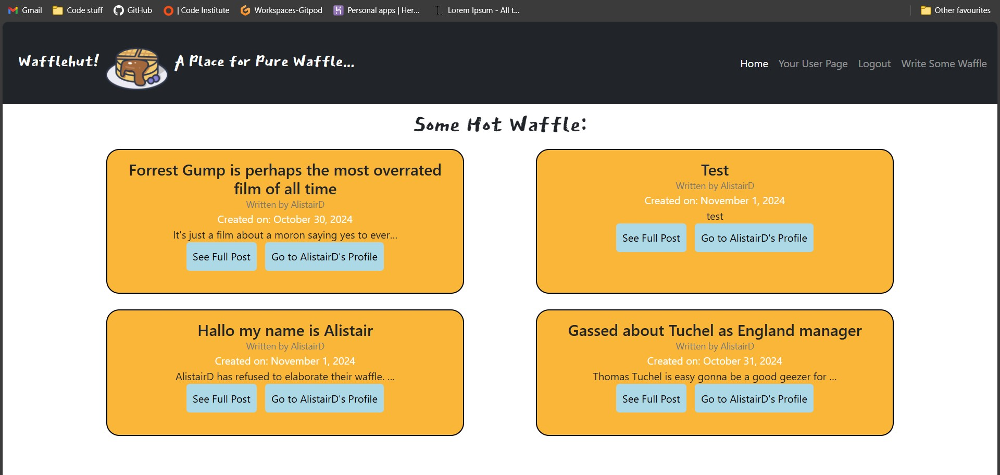
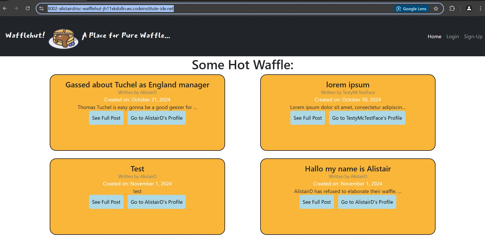
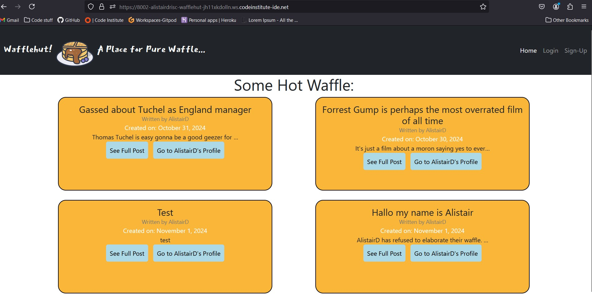

## Lighthouse

For the home page:
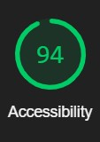

For the userpage:
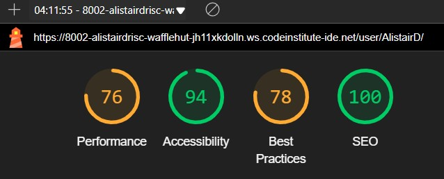

For a view_full_post page:

Sign in page:
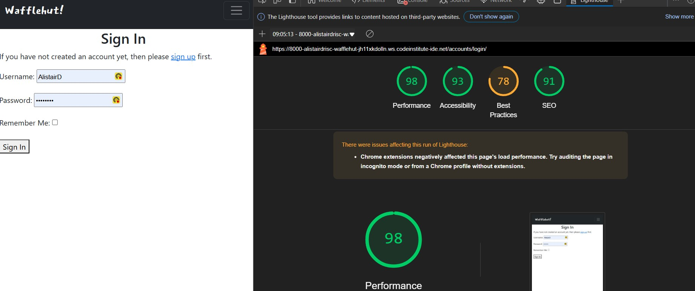

Sign out page:
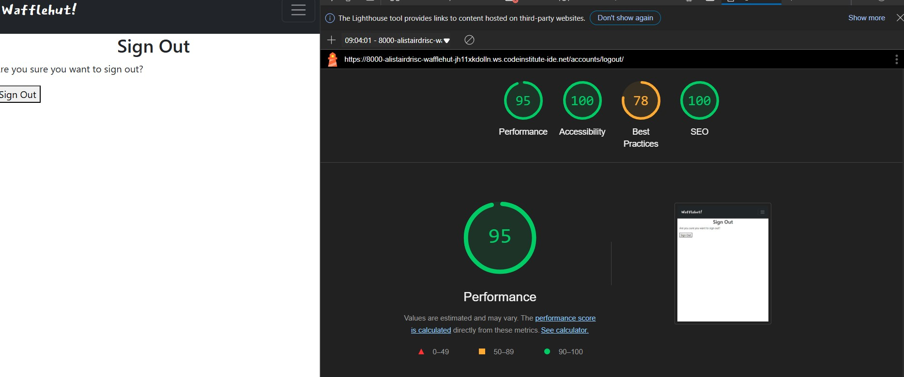

Sign-up page
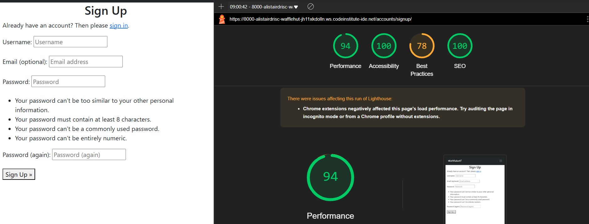

## Validation

Validation can be seen here in the 

## Responsivity

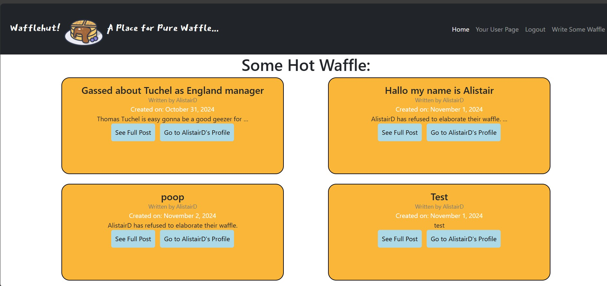
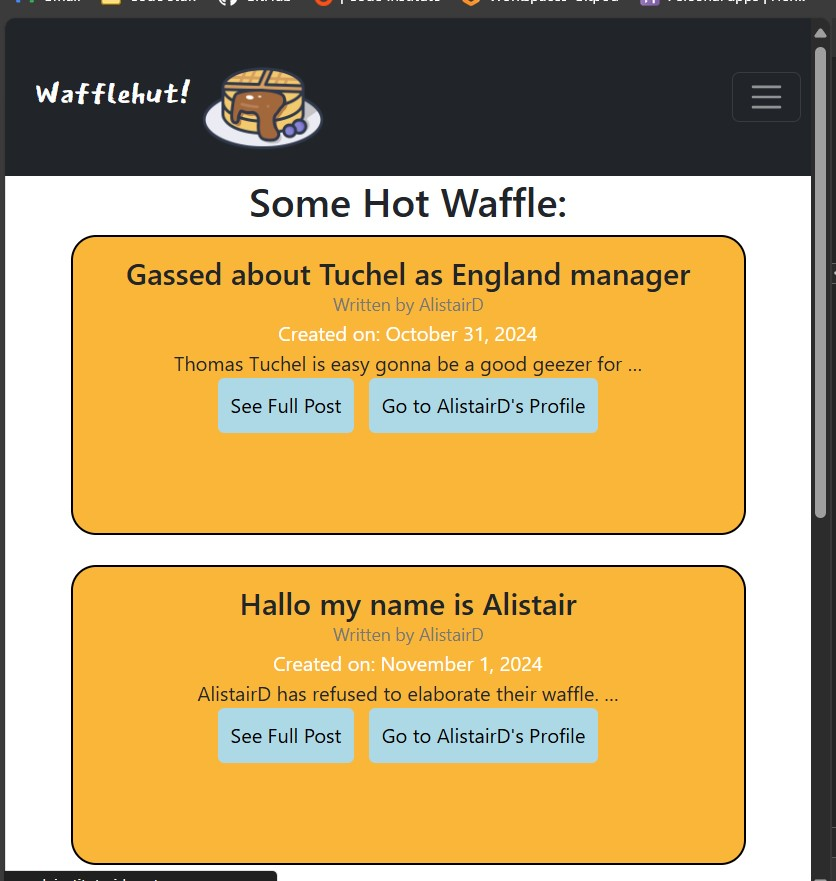
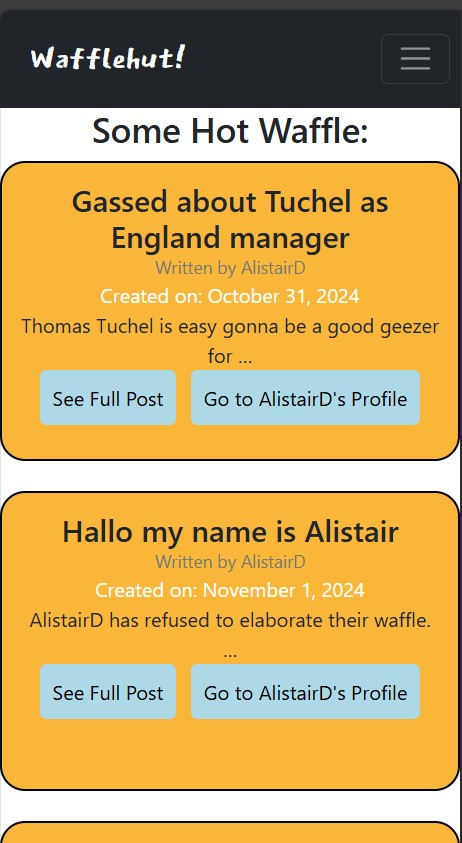
