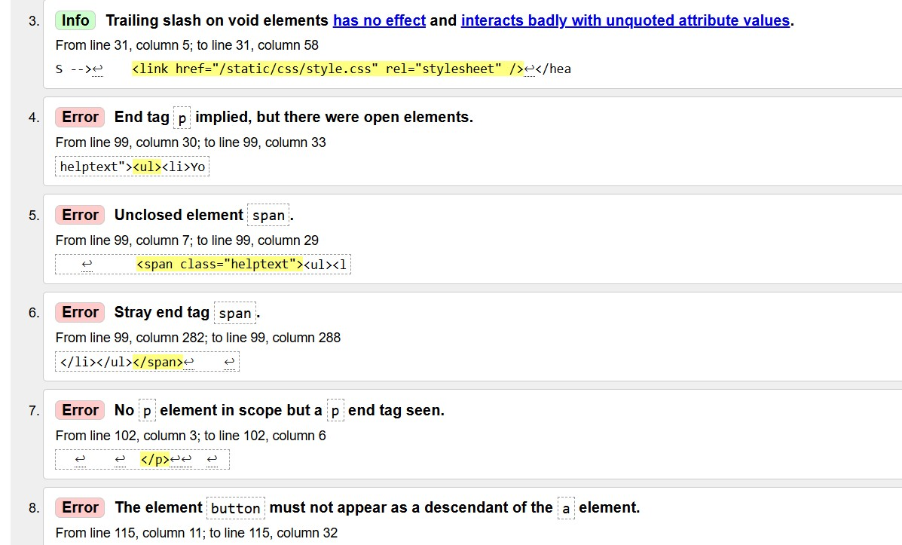

# Validation

The validation is strange as the website keeps using old css and js files that have since been updated or deleted. I have done a hard refresh more times than I can count and cleared my cache and browsing history several times also, but still the problem seems to persist so I have to just show files with errors that the browser files don't even have anymore unfortunately.

